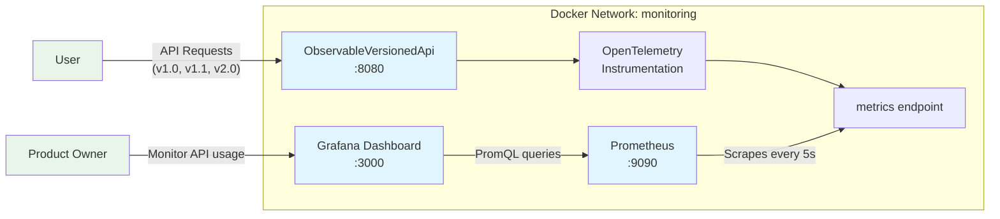

# API Versioning with Custom Metrics Demo
*Built as a learning exercise and demonstration of modern .NET development practices.*

## Overview

This project demonstrates how to solve a common problem in API development: **how to know when you can retire an old version of an API endpoint?**

It makes use of the following technology:

* .Net API
* Swagger
* OpenTelemetry
* Prometheus
* Grafana
* Docker

While OpenTelemetry's built-in ASP.NET Core instrumentation provides excellent HTTP metrics, it doesn't distinguish between different API versions (e.g., v1.0 vs v1.1 vs v2.0) when using route templates like `api/v{version:apiVersion}/HelloWorld`, making it impossible to distinguish between API version usage in Prometheus/Grafana dashboards.

**Solution**: Custom metrics implementation that captures the resolved API version and creates properly labeled metrics for monitoring and analytics.

## Architecture & Design Decisions

### Key Components

```
src/ObservableVersionedApi/
├── Controllers/v1/          # Versioned API controllers
├── Controllers/v2/
├── Metrics/
│   └── ApiMetrics.cs        # Custom metrics service
├── Middleware/
│   └── RequestMetricsMiddleware.cs  # Metrics collection middleware
├── Extensions/
│   └── ApiMetricsExtensions.cs      # DI and OpenTelemetry extensions
├── Grafana/                 # Code for pre-configured dashboards which are provisioned on container startup 
├── Services/v1/             # Version-specific business logic
├── Services/v2/
└── Program.cs               # Application startup and configuration
```

### Architecture Diagram



## Getting Started

### Prerequisites
- .NET 8.0 SDK
- Docker & Docker Compose

### Running the Application

```bash
# Clone and navigate to the project
cd src/ObservableVersionedApi

# Start the complete stack
docker-compose up -d

# Verify services are running
curl http://localhost:8080/api/v1.0/HelloWorld     # API v1.0
curl http://localhost:8080/api/v1.1/HelloWorld     # API v1.1  
curl http://localhost:8080/api/v2.0/WeatherForecast # API v2.0

# Access monitoring
# Grafana: http://localhost:3000 (admin/admin)
# Prometheus: http://localhost:9090
# API Metrics: http://localhost:8080/metrics
```

## Learning Outcomes

This project demonstrates:
- **API Design**: Versioning strategies and backwards compatibility
- **Observability**: Custom metrics integration with OpenTelemetry
- **Clean Code**: SOLID principles and dependency injection
- **DevOps**: Infrastructure as code and containerization  
- **Monitoring**: Prometheus queries and Grafana dashboards

---

